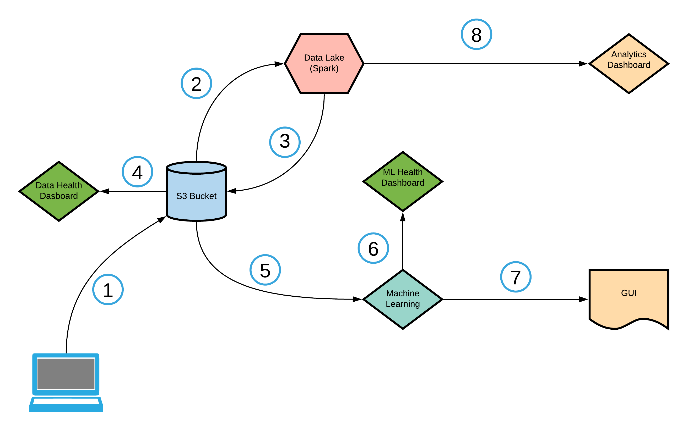

# Data Science and Engineering Capstone

## Introduction
I've collected about 1 million images of animals, plants and humans. 

## Inital Architecture

## Process
The list of numbers below refers to each phase in the diagram
1. Basic preprocess (image naming and directory organization) and upload to s3 bucket. There are about 55 gbs of images.
2. Start of ETL process

## Tools
1. Apache Airflow
2. Apache Spark

## Potential Datasets
Animals:
1. https://www.kaggle.com/salil007/caavo
2. https://www.kaggle.com/alessiocorrado99/animals10
3. https://www.kaggle.com/biancaferreira/african-wildlife
4. https://www.kaggle.com/vic006/beginner
5. https://www.kaggle.com/jerrinbright/cheetahtigerwolf
6. https://www.kaggle.com/gpiosenka/100-bird-species
7. https://www.kaggle.com/virtualdvid/oregon-wildlife
8. https://www.kaggle.com/ashishsaxena2209/animal-image-datasetdog-cat-and-panda
9. https://www.kaggle.com/andrewmvd/animal-faces
10. https://www.kaggle.com/madisona/translated-animals10
11. https://www.kaggle.com/viswatejag/animal-detection-small-dataset
12. https://www.kaggle.com/navneetsurana/animaldataset
13. https://www.kaggle.com/tanlikesmath/the-oxfordiiit-pet-dataset
14. https://www.kaggle.com/kdnishanth/animal-classification

Plants:
1. https://www.kaggle.com/muhammadjawad1998/plants-dataset99-classes?
2. https://www.kaggle.com/olgabelitskaya/flower-color-images?
3. https://www.kaggle.com/alexo98/plant-dataset?
4. https://www.kaggle.com/alxmamaev/flowers-recognition
5. https://www.kaggle.com/yanhanzhu/globalwheatdetectioncombineddata
6. https://www.kaggle.com/msheriey/104-flowers-garden-of-eden
7. https://www.kaggle.com/gverzea/edible-wild-plants?
8. https://www.kaggle.com/sarkararpan/limited-plant-data-color?
9. https://www.kaggle.com/rednivrug/flower-recognition-he?
10. https://www.kaggle.com/alok268/flower-image?
11. https://www.kaggle.com/aritrase/flower-classification?
12. https://www.kaggle.com/ashneg/flower-dataset?
13. https://www.kaggle.com/mbkinaci/purple-flower-photos
14. https://www.kaggle.com/ravishranjan/flower-dataset?

Humans: 
1. https://www.kaggle.com/laurentmih/aisegmentcom-matting-human-datasets?
2. https://www.kaggle.com/atulanandjha/lfwpeople
3. https://www.kaggle.com/greatgamedota/ffhq-face-data-set
4. https://www.kaggle.com/playlist/men-women-classification?
5. https://www.kaggle.com/xhlulu/140k-real-and-fake-faces
6. https://www.kaggle.com/gmlmrinalini/genderdetectionface?
7. https://www.kaggle.com/ashishjangra27/face-mask-12k-images-dataset
8. https://www.kaggle.com/varump66/face-images-13233?
9. https://www.kaggle.com/hereisburak/pins-face-recognition?