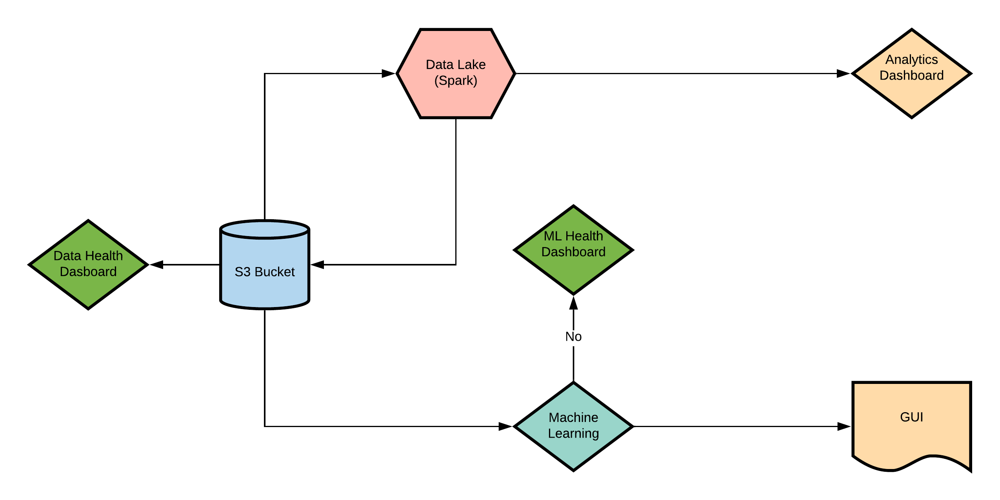

# Data Science and Engineering Capstone

## Inital Architecture

## Potential Datasets
Animals:
1. https://www.kaggle.com/salil007/caavo
2. https://www.kaggle.com/alessiocorrado99/animals10
3. https://www.kaggle.com/biancaferreira/african-wildlife
4. https://www.kaggle.com/vic006/beginner
5. https://www.kaggle.com/jerrinbright/cheetahtigerwolf
6. https://www.kaggle.com/gpiosenka/100-bird-species
7. https://www.kaggle.com/virtualdvid/oregon-wildlife
8. https://www.kaggle.com/ashishsaxena2209/animal-image-datasetdog-cat-and-panda
9. https://www.kaggle.com/andrewmvd/animal-faces
10. https://www.kaggle.com/madisona/translated-animals10
11. https://www.kaggle.com/viswatejag/animal-detection-small-dataset
12. https://www.kaggle.com/navneetsurana/animaldataset
13. https://www.kaggle.com/tanlikesmath/the-oxfordiiit-pet-dataset
14. https://www.kaggle.com/kdnishanth/animal-classification

Plants:
1. https://www.kaggle.com/muhammadjawad1998/plants-dataset99-classes?
2. https://www.kaggle.com/olgabelitskaya/flower-color-images?
3. https://www.kaggle.com/alexo98/plant-dataset?
4. https://www.kaggle.com/alxmamaev/flowers-recognition
5. https://www.kaggle.com/yanhanzhu/globalwheatdetectioncombineddata
6. https://www.kaggle.com/msheriey/104-flowers-garden-of-eden
7. https://www.kaggle.com/gverzea/edible-wild-plants?
8. https://www.kaggle.com/sarkararpan/limited-plant-data-color?
9. https://www.kaggle.com/rednivrug/flower-recognition-he?
10. https://www.kaggle.com/alok268/flower-image?
11. https://www.kaggle.com/aritrase/flower-classification?
12. https://www.kaggle.com/ashneg/flower-dataset?
13. https://www.kaggle.com/mbkinaci/purple-flower-photos
14. https://www.kaggle.com/ravishranjan/flower-dataset?