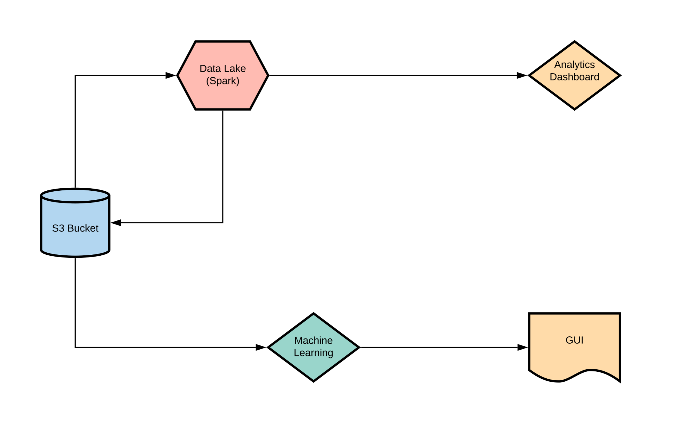

# Data Science and Engineering Capstone

## Potential Datasets
1. https://www.kaggle.com/salil007/caavo
2. https://www.kaggle.com/alessiocorrado99/animals10
3. https://www.kaggle.com/biancaferreira/african-wildlife
4. https://www.kaggle.com/vic006/beginner
5. https://www.kaggle.com/jerrinbright/cheetahtigerwolf
6. https://www.kaggle.com/gpiosenka/100-bird-species
7. https://www.kaggle.com/virtualdvid/oregon-wildlife

## Inital Architecture

