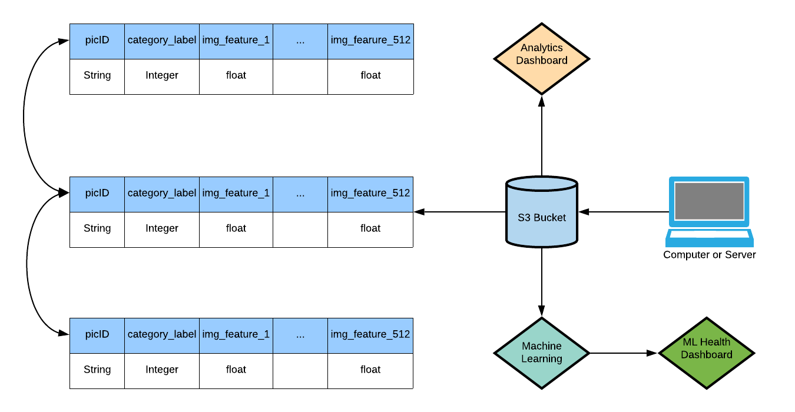

# Data Science and Engineering Capstone

## Introduction
For this project, I've collected about 1 million images of animals, plants and humans. I've evenly distributed the image count for each category, resulting in: 

    * 376,683 images of animals
    * 323,695 images of humans
    * 310,030 images of plants

The end goal is to classify plants from humans from animals. Therefore, processing and preparation for classification and clustering was done. 
A whole pipeline was built using Airflow and other tools in order to ease the Machine Learning process. 

The main obstacle faced here was dealing with the massive 
amount of data in the most optimal way (55 gbs of images). The process below was what I found to be suitable. 

## Architecture

The diagram above provides an overview of the process. The data is first processed on a computer or server, then sent to an s3 bucket. The end goal is to 
classify and cluster the images, while regularly refining the model in the future. 

The data model here includes the category label, picture ID, and all 512 features for each image, which is all that is required for both the 
clustering and classification applications. Each table is split per category, and each one of those tables is split into several smaller ones. This 
makes the entire process more convenient for the Machine Learning. 

## Process
1. Basic preprocess (image naming and directory organization) and upload to s3 bucket. There are about 55 gbs of images.
    * The raw data had to be unpacked from all the different folders and renamed (to avoid naming conflicts) this is done by running the **dataFunctions/unpack_images.py** file. 
    * The s3 Bucket is created using **AWS_Tools/s3_create.py** (can also be deleted with **AWS_Tools/s3_delete.py**)
2. ETL process:
    * 512 features are first extracted for each image using the tensorflow hub api https://tfhub.dev/google/imagenet/mobilenet_v1_050_128/feature_vector/4. This process is divided 
    in parallel among the three image categories. 
    * A data quality/verification check is made for the features (in parallel for the three categories as well)
    * The data sets are constructed in parallel, each image is given a unique ID and category label (0 for plant, 1 for animal, 2 for human)
    * Another data quality check is made per category and for every csv file. 
    * The data is then uploaded in parallel to an s3 bucket. This makes the data available for not just myself, but many others who I can share with. 
        * Again, to make the Machine Learning more convenient, the output csv files are separated into 10,001 rows per file. This is because the matrix dimensions
        are 10,001 * 514 for every file. 

Note that the related files for these operations are
1. **FeatureExtractorOperator.py**
2. **FeatureLabelOperator.py**
3. **FeatureVerificationOperator.py**
4. **CsvVerificationOperator.py**
5. **s3UploadOperator.py**

The DAG file is **db_image_pipeline.py**. These files can all be found in the airflow directory.

## Dag structure:

    

## Tools
1. Apache Airflow was used to manage the data pipeline
2. boto3 to manage creating, uploading to and deleting the s3 bucket 
3. s3 Bucket to make the data available to over 100 other participants
4. tensorflow hub (to extract the image features)
5. python libraries such as pandas to manage the databases

## Other scenarios
The project is essentially divided into three phases. 
1. The initial push of about 1 million images.
2. Scheduling the pipeline to run at 7am every day
3. Increasing the data by 100x

For the second scenario, new data will constantly be added everyday, and the pipeline will be adjusted accordingly. 
The only thing that will need to be changed is the path to the new images and feature output. 

For the third scenario, the pipeline will have to further divided into more parallel processes within the categories rather than just the categories, and a more powerful machine or server 
will need to be used to extract and transform the data. However, the core process will remain the same. The images will also be stored on
separate drives (5500 of images) for the initial push.

## t-SNE Visualization of Data:
The following is a sample visualization of the three categories when using t-SNE. 

There seems to be a subtle separation between the clusters from the middle upwards. However, note 
that this is only a small sample of the data that exists (about 30,000 rows). The final dashboard that will 
contain the t-SNE will contain the entire data set, and will be undersampled without compromising the integrity 
of the clusters. 

    

## Checklist:
- [x] Engineering the data  
- [X] t-SNE implementation (clustering)  
- [ ] Classification  
- [ ] Dashboards (health and clustering)

The Machine Learning is coming soon!

## Data Dictionary:

## Datasets Used

Animals:
1. https://www.kaggle.com/salil007/caavo
2. https://www.kaggle.com/alessiocorrado99/animals10
3. https://www.kaggle.com/biancaferreira/african-wildlife
4. https://www.kaggle.com/vic006/beginner
5. https://www.kaggle.com/jerrinbright/cheetahtigerwolf
6. https://www.kaggle.com/gpiosenka/100-bird-species
7. https://www.kaggle.com/virtualdvid/oregon-wildlife
8. https://www.kaggle.com/ashishsaxena2209/animal-image-datasetdog-cat-and-panda
9. https://www.kaggle.com/andrewmvd/animal-faces
10. https://www.kaggle.com/madisona/translated-animals10
11. https://www.kaggle.com/viswatejag/animal-detection-small-dataset
12. https://www.kaggle.com/navneetsurana/animaldataset
13. https://www.kaggle.com/tanlikesmath/the-oxfordiiit-pet-dataset
14. https://www.kaggle.com/kdnishanth/animal-classification

Plants:
1. https://www.kaggle.com/muhammadjawad1998/plants-dataset99-classes?
2. https://www.kaggle.com/olgabelitskaya/flower-color-images?
3. https://www.kaggle.com/alexo98/plant-dataset?
4. https://www.kaggle.com/alxmamaev/flowers-recognition
5. https://www.kaggle.com/yanhanzhu/globalwheatdetectioncombineddata
6. https://www.kaggle.com/msheriey/104-flowers-garden-of-eden
7. https://www.kaggle.com/gverzea/edible-wild-plants?
8. https://www.kaggle.com/sarkararpan/limited-plant-data-color?
9. https://www.kaggle.com/rednivrug/flower-recognition-he?
10. https://www.kaggle.com/alok268/flower-image?
11. https://www.kaggle.com/aritrase/flower-classification?
12. https://www.kaggle.com/ashneg/flower-dataset?
13. https://www.kaggle.com/mbkinaci/purple-flower-photos
14. https://www.kaggle.com/ravishranjan/flower-dataset?

Humans: 
1. https://www.kaggle.com/laurentmih/aisegmentcom-matting-human-datasets?
2. https://www.kaggle.com/atulanandjha/lfwpeople
3. https://www.kaggle.com/greatgamedota/ffhq-face-data-set
4. https://www.kaggle.com/playlist/men-women-classification?
5. https://www.kaggle.com/xhlulu/140k-real-and-fake-faces
6. https://www.kaggle.com/gmlmrinalini/genderdetectionface?
7. https://www.kaggle.com/ashishjangra27/face-mask-12k-images-dataset
8. https://www.kaggle.com/varump66/face-images-13233?
9. https://www.kaggle.com/hereisburak/pins-face-recognition?